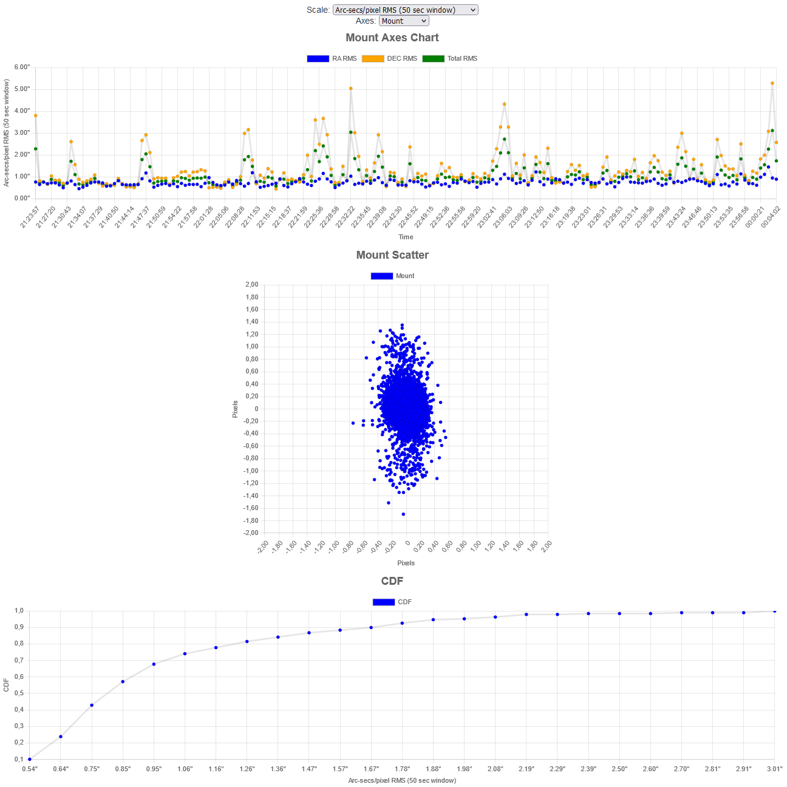

# Astrophotography guiding performance
This application reads the logs created by the ASIAIR device for PHD guiding and the Autorun log for image capture times.

These logs are used to create a guiding performance graph and recommends frames to be dropped based on guiding performance.

