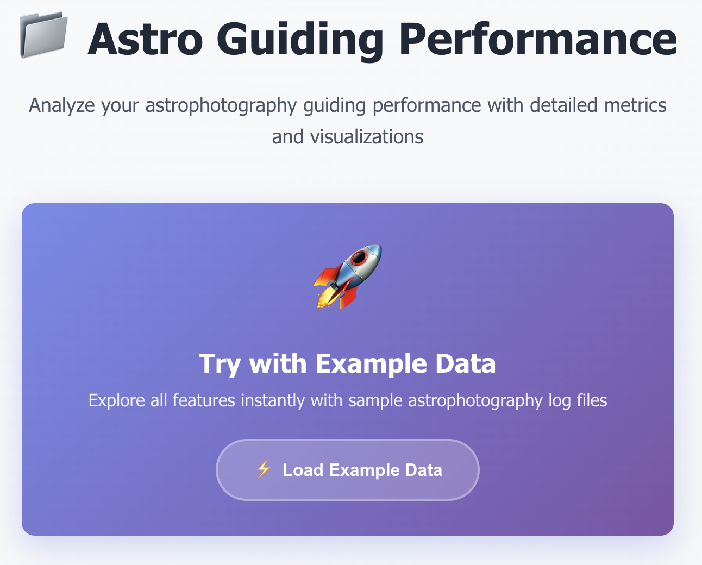
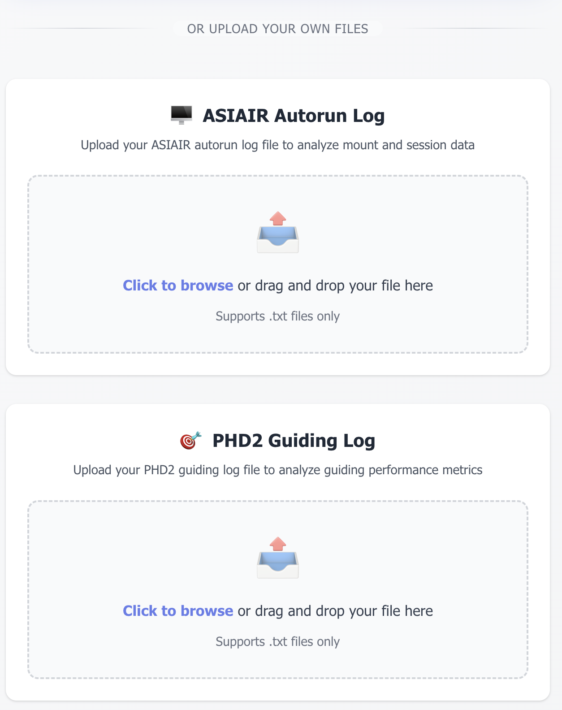
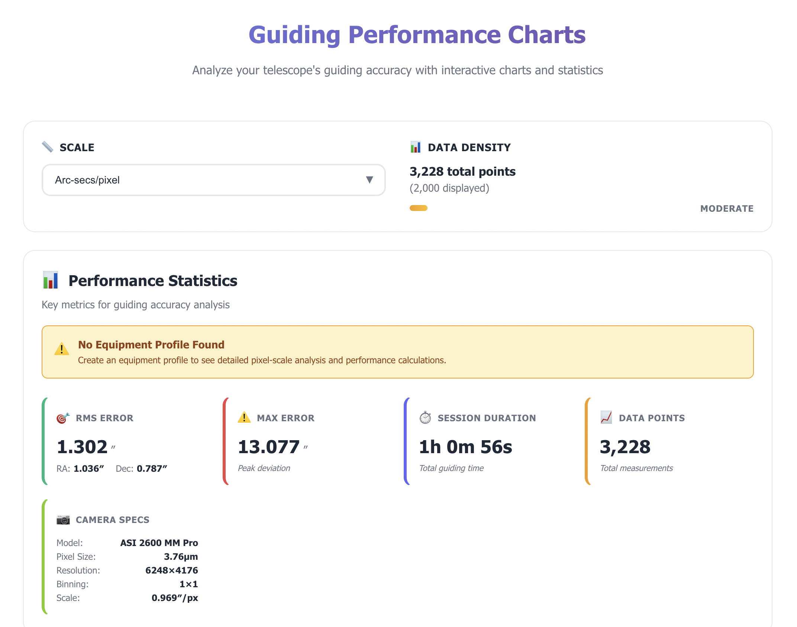
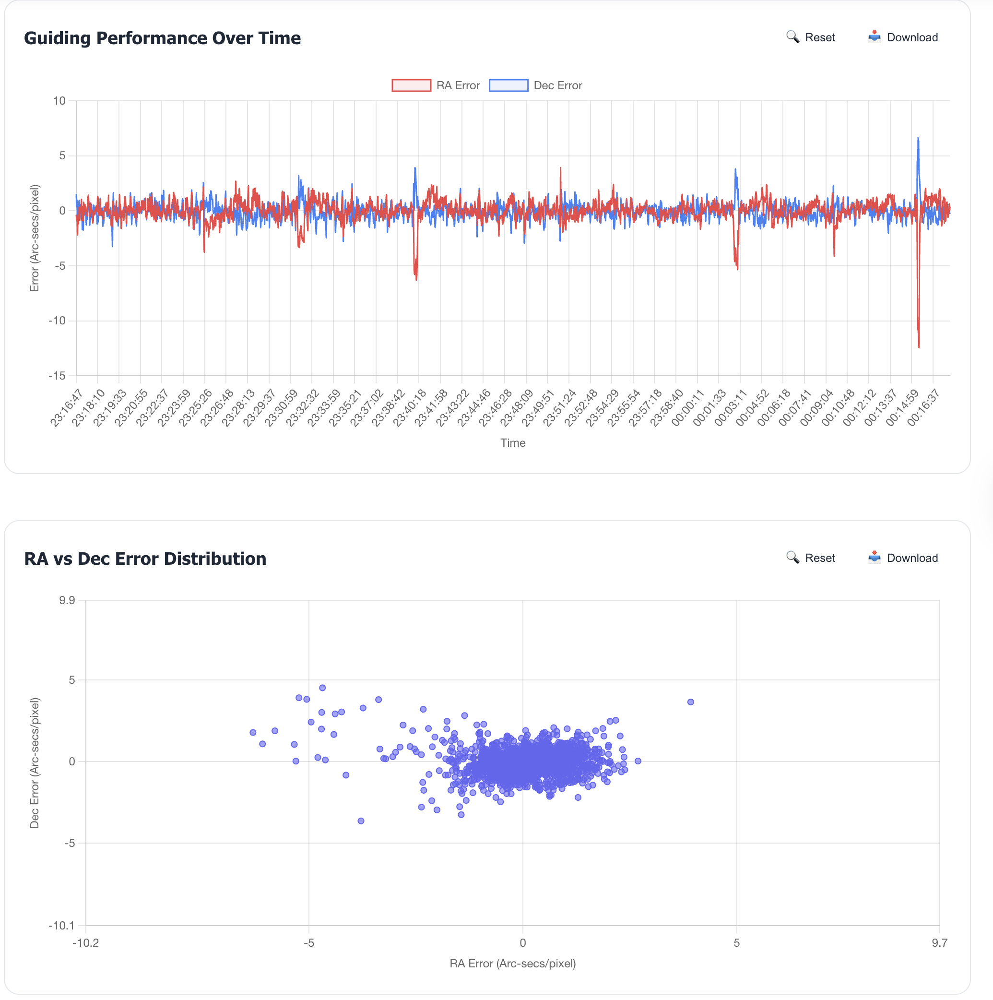
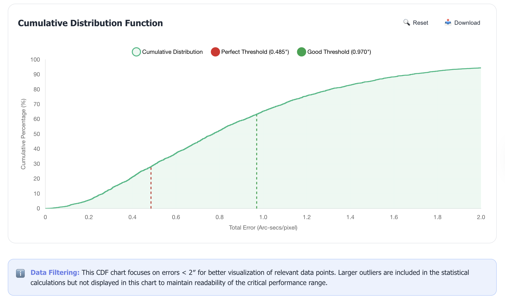
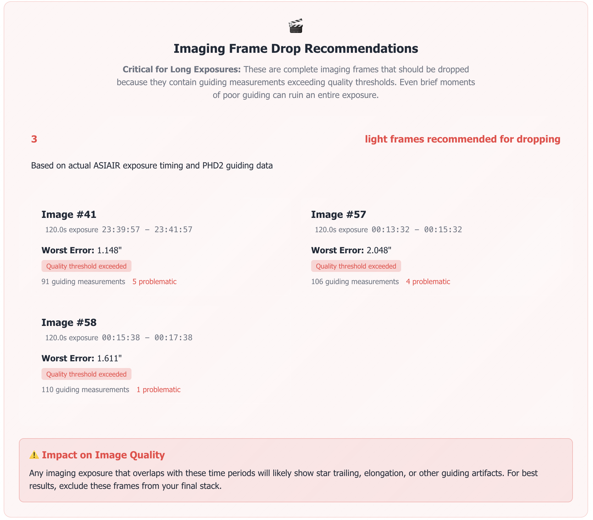
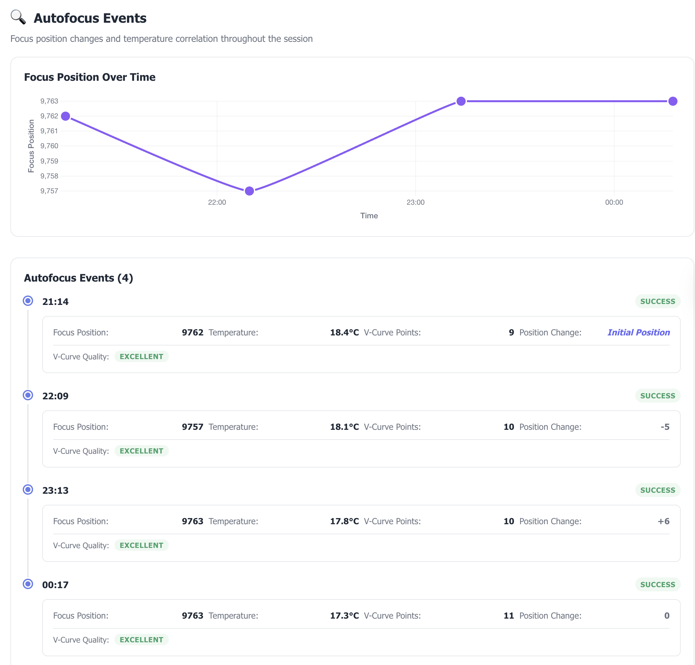

# Astro Guiding Performance Analysis

🔭 **A comprehensive tool for analyzing PHD2 autoguiding performance in astrophotography**

This application provides quantitative analysis of PHD2 guiding logs to help astrophotographers evaluate their autoguiding performance and optimize their imaging setup. The tool transforms raw guiding data into meaningful metrics that directly relate to image quality potential.

**Live Demo:** https://astro-boys.nl

## ✨ Latest Features & Updates

### 🎯 **Frame Recommendations System**
- **Smart Frame Analysis**: Automatically identifies problematic frames using three detection algorithms:
  - Large guiding errors (>3 pixel threshold, equipment-aware)
  - Sudden position jumps (>2 pixel threshold) 
  - Low SNR frames (SNR < 10) indicating poor star detection
- **Export Functionality**: Copy frame timestamps to clipboard or export to text file
- **Performance Impact**: Shows potential RMS improvement from removing bad frames
- **Integration**: Seamlessly embedded in the analysis workflow

### 📋 **Progress Tracking Breadcrumbs**
- **Visual Progress Indicator**: Fixed sidebar showing analysis completion status
- **Section Navigation**: Click any step to jump to that analysis section
- **Responsive Design**: Collapses to icon-only on mobile, repositions to bottom
- **Real-time Updates**: Automatically tracks scroll progress through sections

### 🔄 **Enhanced User Experience**
- **Hamburger Menu**: Mobile-responsive navigation with smooth animations
- **Example Data Integration**: One-click sample data loading for immediate feature exploration
- **Improved File Upload**: Drag-and-drop interface with visual feedback
- **Modern UI Components**: Consistent design language throughout the application

## 🚀 Core Features

- **📊 Comprehensive Statistical Analysis**: RMS error calculations, percentile analysis, and cumulative distribution functions
- **🎯 Quality Threshold Analysis**: Dual-threshold system for "Perfect" (sub-pixel) and "Good" (1-pixel) data classification  
- **📈 Interactive Visualizations**: Real-time charts with Chart.js integration, including enhanced CDF with threshold visualization
- **⚙️ Equipment Management**: Profile-based telescope and camera specifications for accurate pixel scale calculations
- **📱 Responsive Design**: Modern Vue 3 application with mobile-friendly interface and touch optimization
- **🔬 Scientific Methodology**: Transparent calculation methods with comprehensive documentation
- **🔧 Advanced Analysis Tools**: Frame recommendation system, environmental data tracking, and quality metrics

## 📸 Application Screenshots

### Home Page - Try with Example Data
Get started instantly with sample astrophotography log files. The prominent example data button allows users to explore all features immediately without needing their own files.



### Home Page - Upload Your Own Files
Upload your own PHD2 and ASIAIR log files using the intuitive drag-and-drop interface. Support for multiple file formats with clear upload instructions and visual feedback.



### Guiding Performance Dashboard
Comprehensive overview of your autoguiding session with key performance metrics, RMS statistics, and equipment information displayed in an intuitive layout.



### Interactive Analysis Charts
Multiple chart types provide detailed insights into guiding performance, including time series data, error distributions, and cumulative distribution functions with quality thresholds.



### Cumulative Distribution Function (CDF) Analysis
Advanced statistical visualization showing the percentage of guiding errors below various thresholds, with "Perfect" and "Good" quality markers for easy performance assessment.



### Frame Drop Recommendations
Smart analysis identifies problematic frames with large errors, sudden jumps, or low SNR values. Export functionality allows easy integration with your image processing workflow.



### Autofocus Event Timeline
Track autofocus events throughout your imaging session, correlating focus adjustments with guiding performance changes and temperature variations.



### Key Interface Elements:
- **🚀 Example Data Button**: Instantly load sample data to explore features
- **📋 Progress Breadcrumbs**: Track analysis completion and navigate sections
- **📊 Interactive Charts**: Zoom, pan, and explore guiding data patterns
- **🎯 Frame Recommendations**: Identify and export problematic frames
- **⚙️ Equipment Profiles**: Manage telescope and camera configurations
- **📱 Mobile Responsive**: Full functionality on all device sizes

## 🧮 Analysis Methodology

### Data Processing Pipeline

1. **Input Processing**: PHD2 guide logs with time-series correction data (dx, dy in pixels)
2. **Coordinate Transformation**: Convert pixel coordinates to angular measurements using equipment specifications
3. **Statistical Analysis**: Calculate RMS errors, percentiles, and cumulative distributions
4. **Quality Assessment**: Apply dual-threshold analysis for performance classification

### Mathematical Foundation

#### Pixel Scale Calculation
```
Pixel Scale (″/px) = (Pixel Size μm × 206,265) / Focal Length mm
```

#### Angular Error Conversion
```
Error (arcseconds) = Error (pixels) × Pixel Scale × Binning Factor
```

#### RMS Error Calculation
```
RMS = √(Σ(error²) / n)
```
Calculated separately for RA, Dec, and combined total accuracy.

### Quality Thresholds

#### Perfect Data Threshold: 0.5 Pixels
- **Rationale**: Sub-pixel accuracy ensures minimal star trailing
- **Application**: Critical for high-resolution imaging and long focal lengths
- **Typical Range**: 15-25% for well-tuned systems

#### Good Data Threshold: 1.0 Pixel  
- **Rationale**: One-pixel accuracy suitable for most astrophotography
- **Application**: Excellent for standard deep-sky imaging
- **Typical Range**: 60-80% for properly configured systems

### Equipment-Specific Calibration

The analysis automatically adjusts calculations based on:
- **Camera Specifications**: Pixel size, resolution, binning settings
- **Telescope Setup**: Focal length for accurate pixel scale
- **Guide vs. Main Camera**: Separate calculations for imaging and guiding systems

Example for ASI 2600 MM Pro (3.76μm pixels) with 800mm Newtonian:
- Pixel Scale: 0.970″/pixel
- Perfect Threshold: 0.485″
- Good Threshold: 0.970″

## 🎯 Performance Interpretation

### Excellent Performance (>40% Perfect, >80% Good)
- **RMS Total**: <0.5″
- **Characteristics**: Exceptional guiding suitable for any application
- **Recommendations**: System is well-optimized

### Good Performance (15-40% Perfect, 60-80% Good)  
- **RMS Total**: 0.5-1.0″
- **Characteristics**: Solid performance for most projects
- **Recommendations**: Minor optimizations may yield improvements

### Acceptable Performance (5-15% Perfect, 30-60% Good)
- **RMS Total**: 1.0-1.5″
- **Characteristics**: Adequate for casual imaging
- **Recommendations**: Consider mount, guiding, or environmental improvements

### Needs Improvement (<5% Perfect, <30% Good)
- **RMS Total**: >1.5″
- **Characteristics**: Significant issues affecting image quality
- **Recommendations**: Systematic review of entire guiding setup required

## 🔧 Technical Implementation

### Frontend Architecture
- **Framework**: Vue 3 with Composition API and TypeScript
- **Charts**: Chart.js with custom CDF enhancements
- **State Management**: Vuex for application state
- **Styling**: Custom CSS with CSS variables for theming
- **Build Tool**: Vite with modern JavaScript features

### Key Components

#### PHDLogGuidingCharts.vue
- Enhanced CDF visualization with threshold lines
- Interactive charts with zoom functionality focused on 0-2″ error range
- Real-time statistical calculations

#### ChartStatistics.vue  
- Perfect/Good data percentage cards
- Conditional rendering based on scale selection
- Equipment-aware threshold calculations

#### Equipment.vue
- Profile management system with import/export
- Local state management for equipment specifications
- Integration with pixel scale calculations throughout the application

### Data Validation & Accuracy

#### Cross-Validation
- CDF chart percentages validate calculated quality metrics
- Threshold lines in CDF provide visual confirmation of analysis accuracy
- No data filtering applied to maintain integrity of actual performance

#### Limitations & Considerations
- Assumes linear relationship between guiding errors and image quality
- Conservative thresholds; actual tolerance may vary by conditions
- Analysis limited by quality of PHD2 calibration data
- Does not account for atmospheric seeing variations

## 🛠️ Development Setup

### Prerequisites
- **Node.js**: Version 16+ recommended (tested with Node.js v22.19.0)
- **npm**: Version 8+ (comes with Node.js)
- **Modern Browser**: Chrome, Firefox, Safari, or Edge with ES2020+ support

### Installation & Development
```bash
# Navigate to the application directory
cd web/agp

# Install dependencies
npm install

# Start development server
npm run dev

# Application will be available at:
# - Local: http://localhost:5173/
# - Network: http://[your-ip]:5173/
```

### Building for Production
```bash
# Build optimized production bundle
npm run build

# Output will be in the 'dist/' directory
```

### Package Dependencies Status
- **Vue.js**: 3.2.31 (stable, TypeScript compatible)
- **Chart.js**: 3.7.1 with vue-chart-3 wrapper
- **TypeScript**: 5.0.0 (modern version)
- **Vite**: 7.3.0 (fast build tool)
- **Security**: 0 vulnerabilities

For detailed package update information, see [PACKAGE_UPDATES.md](PACKAGE_UPDATES.md).

## 📁 Project Structure

```
astro-guiding-performance/
├── 📊 data/                          # Sample PHD2 and ASIAIR log files
│   ├── PHD2_GuideLog_2022-03-18_210258.txt
│   └── Autorun_Log_2022-03-18_211302.txt
├── 🖼️ images/                        # Documentation screenshots  
│   ├── home_page_try_with_example_data.png      # Landing page with example data
│   ├── home_page_or_try_with_your_own_files.png # File upload interface
│   ├── guiding_performance.png          # Main dashboard overview
│   ├── charts.png                       # Interactive analysis charts
│   ├── cdf.png                          # Cumulative distribution function
│   ├── frame_drop_recommendations.png   # Frame analysis and recommendations
│   └── autofocus_events.png             # Focus event timeline
├── 📋 PACKAGE_UPDATES.md             # Dependency management documentation
├── 🌐 web/agp/                       # Vue.js application root
│   ├── 📦 package.json               # Dependencies and scripts
│   ├── 🔧 babel.config.js            # Babel transpilation config
│   ├── 📝 tsconfig.json              # TypeScript configuration
│   ├── 🌍 public/                    # Static assets and index.html
│   │   ├── index.html
│   │   ├── favicon.ico
│   │   ├── 📊 data/                  # Public example data files
│   │   └── 🖼️ img/icons/             # PWA icons and favicons
│   └── 💻 src/                       # Application source code
│       ├── 🎯 App.vue                # Root component with navigation
│       ├── 🚀 main.ts                # Application entry point
│       ├── 🧩 components/            # Reusable Vue components
│       │   ├── 📈 GuidingPerformance.vue    # Main analysis dashboard
│       │   ├── 📊 PHDLogGuidingCharts.vue   # Interactive chart container
│       │   ├── 🎯 FrameRecommendations.vue  # Problem frame analysis
│       │   ├── 📋 AnalysisProgressBreadcrumbs.vue # Progress tracking
│       │   ├── 📊 Charts/            # Individual chart components
│       │   │   ├── ChartStatistics.vue      # Performance metrics cards
│       │   │   ├── LineChartComponent.vue   # Time series charts
│       │   │   ├── ScatterChartComponent.vue # Error distribution plots
│       │   │   ├── ChartControls.vue        # Chart interaction controls
│       │   │   ├── AutofocusTimeline.vue    # Focus event tracking
│       │   │   └── TemperatureChart.vue     # Environmental data
│       │   ├── 📁 File/              # File handling components
│       │   │   ├── FileUploader.vue         # Main upload interface
│       │   │   └── FileUploadComponent.vue  # Individual file dropzone
│       │   └── ⚙️ Equipment/         # Equipment management
│       │       └── EquipmentProfileForm.vue # Telescope/camera profiles
│       ├── 📄 views/                 # Page-level components
│       │   ├── 🏠 Home.vue           # Landing page with file upload
│       │   ├── 📊 PHDLogViewer.vue   # Main analysis interface
│       │   ├── ⚙️ Equipment.vue      # Equipment profile management
│       │   ├── 📚 Methodology.vue    # Analysis documentation
│       │   └── ℹ️ About.vue          # Application information
│       ├── 🔄 services/              # Data processing logic
│       │   ├── PHDLogReader.ts       # PHD2 log file parsing
│       │   └── ASIAIRLogReader.ts    # ASIAIR log file parsing
│       ├── 🗂️ store/                 # Vuex state management
│       │   ├── index.ts              # Root store configuration
│       │   └── modules/              # Feature-specific stores
│       │       ├── App/              # Application state
│       │       ├── PHD/              # PHD2 data management
│       │       ├── ASIAIR/           # ASIAIR data management
│       │       └── Equipment/        # Equipment profile management
│       ├── 🧮 utilities/             # Helper functions and constants
│       │   ├── index.ts              # Utility exports
│       │   ├── helpers.ts            # General helper functions
│       │   ├── LocalStorageUtilities.ts # Browser storage
│       │   ├── SpecialLogType.ts     # Log type definitions
│       │   ├── constants/            # Application constants
│       │   │   ├── index.ts
│       │   │   └── physics.ts        # Astronomical calculations
│       │   └── computations/         # Mathematical analysis
│       │       ├── index.ts
│       │       ├── statistics.ts     # Statistical calculations
│       │       ├── quality.ts        # Quality metric analysis
│       │       ├── astronomical.ts   # Pixel scale & conversions
│       │       └── test.ts           # Unit tests
│       └── 🎨 router/                # Vue Router configuration
│           └── index.ts              # Route definitions
├── 📖 todo.md                        # Development task tracking
└── 📋 README.md                      # This documentation file
```

### Key Architecture Decisions

- **🏗️ Component-Based**: Modular Vue 3 components with TypeScript
- **📊 Chart.js Integration**: Custom wrapper components for consistent charting
- **🗂️ Vuex State Management**: Centralized data management with module-based organization  
- **🧮 Utilities Structure**: Organized mathematical computations and helper functions
- **📱 Responsive Design**: Mobile-first approach with CSS Grid and Flexbox
- **🔄 Service Layer**: Dedicated parsers for different log file formats
- **⚙️ Equipment Profiles**: Persistent storage for telescope/camera configurations

## 🤝 Contributing

Contributions are welcome! Here are some areas where the project could be enhanced:

### 🔬 **Analysis Features**
- **Advanced Statistics**: Allan variance, power spectral density analysis
- **Outlier Detection**: Automated detection and filtering of anomalous data points
- **Environmental Correlation**: Integrate weather data, seeing conditions, temperature effects
- **Multi-Session Analysis**: Compare performance across multiple guiding sessions

### 🔧 **Technical Improvements**  
- **Additional Log Formats**: Support for MaxIm DL, Sequence Generator Pro, other guiding software
- **Plate Solving Integration**: Drift analysis using astrometric solutions
- **Export Features**: PDF reports, CSV data export, session comparison reports
- **Performance Optimization**: Web Workers for large file processing, chart performance improvements

### 📱 **Platform Expansion**
- **Mobile App**: React Native or Flutter implementation
- **Desktop App**: Electron wrapper for offline usage
- **API Development**: RESTful API for programmatic access
- **Cloud Integration**: Session storage, sharing, and collaboration features

### 🧪 **Testing & Quality**
- **Unit Tests**: Comprehensive test coverage for analysis algorithms
- **Integration Tests**: End-to-end user workflow testing
- **Performance Benchmarking**: Analysis speed optimization for large datasets
- **Accessibility**: WCAG compliance and screen reader support

### Getting Started with Development
1. Fork the repository
2. Create a feature branch (`git checkout -b feature/amazing-feature`)
3. Follow the development setup instructions above
4. Run tests and ensure code quality (`npm run test`, `npm run lint`)
5. Submit a pull request with detailed description

The codebase uses TypeScript, Vue 3 Composition API, and follows modern web development practices. Check the utilities and computations folders for mathematical analysis implementations.

## 📚 References

- **PHD2 Guiding**: [OpenPHDGuiding.org](https://openphdguiding.org/)
- **Pixel Scale Formula**: Standard astronomical CCD equation
- **Statistical Methods**: Classical RMS and cumulative distribution analysis
- **Astrophotography Best Practices**: Sub-pixel guiding requirements

## 📄 License

This project is open source. Please contribute improvements and report issues.

## 🔄 Recent Updates & Changelog

### Version 2.0+ Features (2024)
- ✅ **Frame Recommendations System**: Automated problematic frame detection and export
- ✅ **Progress Breadcrumbs**: Visual navigation and completion tracking
- ✅ **Mobile Responsive Design**: Hamburger menu and touch-optimized interface
- ✅ **Enhanced File Upload**: Drag-and-drop with visual feedback
- ✅ **Example Data Integration**: One-click sample data loading
- ✅ **Package Security Updates**: Updated dependencies and vulnerability fixes

### Technical Improvements
- ✅ **TypeScript Integration**: Full type safety throughout the application
- ✅ **Modular Architecture**: Organized utilities and computation modules
- ✅ **Performance Optimization**: Efficient chart rendering and data processing
- ✅ **Code Quality**: ESLint rules and consistent coding standards

For detailed technical changes, see [PACKAGE_UPDATES.md](PACKAGE_UPDATES.md).

## 🏆 Recognition & Usage

This application has been developed with input from the astrophotography community and implements industry-standard practices for guiding analysis. It's used by amateur astronomers worldwide to optimize their imaging setups and achieve better astrophotography results.

**Community Features:**
- 🌟 Open source and freely available
- 📖 Comprehensive documentation and methodology
- 🔬 Scientifically validated analysis algorithms  
- 👥 Community-driven feature development
- 🌍 International user base and multi-language support planning

---

**Developed for the astrophotography community** 🌌  
*Making precision guiding analysis accessible to everyone*

**Questions or suggestions?** Open an issue on GitHub or contribute to the project!